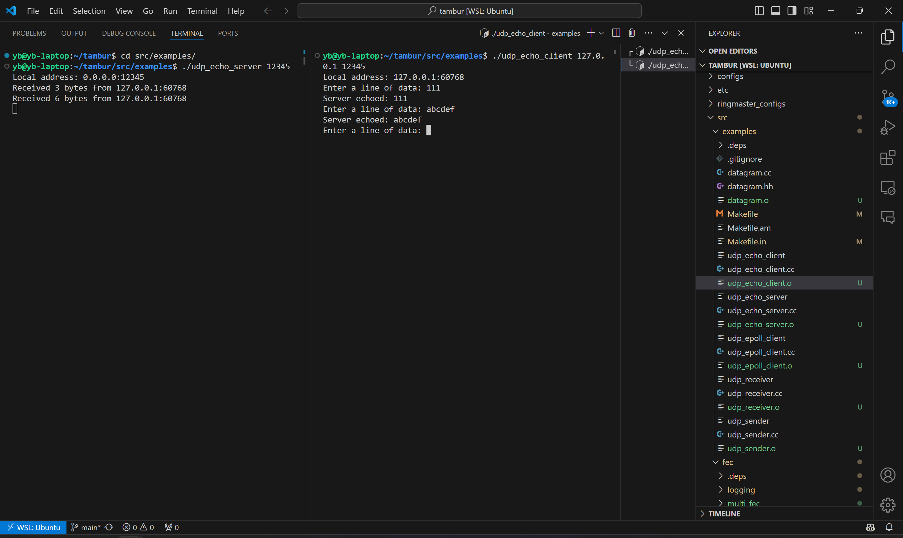
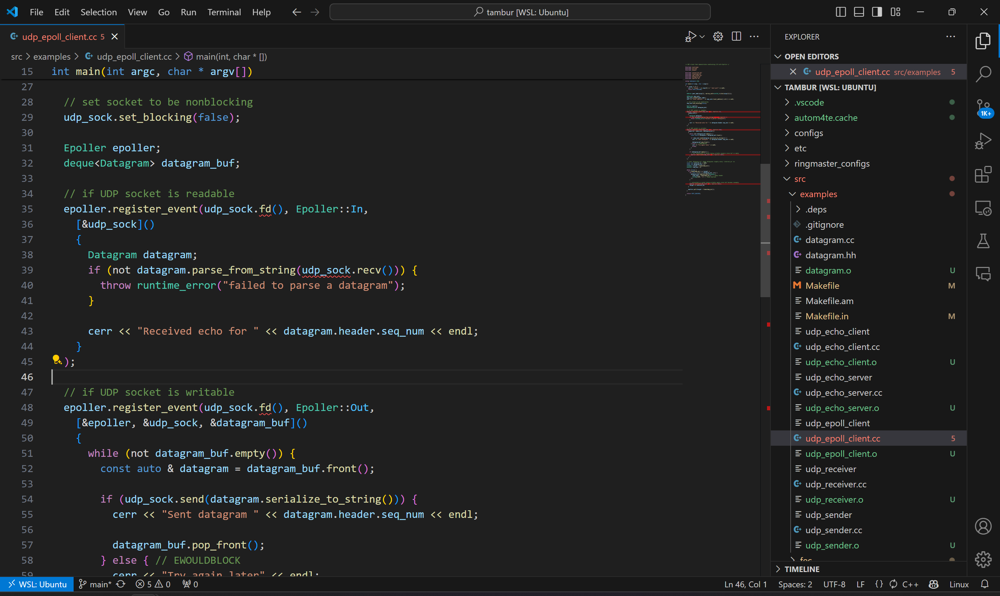

# Devlog

## 240421

In order to build up a Network Coding platform for video streaming, we can start by referencing existing FEC video coding papers and codes.

So I read the tambur paper and build its source code.

**Paper Analysis**:

1. The first chapter is about the introduction of the tambur. Its a FEC video coding algorithm presented with a custom code implementation.
2. The second chapter is about the background. It explains FEC coding, including block codes and streaming codes. Explaining why we need a new FEC algorithm.
3. The third chapter is about analysing the packet loss. The goal of the code is to recover the lost packets. Thus it's important to understand how the packets are lost.
4. The fourth chapter is about the tambur algorithm. It explains the algorithm in detail.
5. The fifth chapter is about the evaluation of the tambur algorithm.
6. Related work
7. Conclusion

Notice that the 4.3 section of the paper is the implementation of the tambur algorithm. The code is written in C++ and uses several libraries. One of them is **Ringmaster**, a new video conferencing platform that emulates one-on-one video calls for benchmarking FEC schemes.

**Code**

[Repository of Ringmaster](https://github.com/microsoft/ringmaster)

[Repository of Tambur](https://github.com/Thesys-lab/tambur)

Tambur provides a script `tambur_install.sh` to install the enviroment, intended for Ubuntu system. The script would install dependent softwares and python packages, and then compile the tambur code. I successfully run the script using WSL2 on Windows 11. I place the tambur directory in the `~/` directory, which seems to be hardcoded in the script.

We can test the example code in `src/examples/` to check if the installation is successful. We can run `./udp_echo_server 12345` and `./udp_echo_client 127.0.0.1 12345` to test the UDP communication. `12345` is the port number. The server will echo the message sent by the client.

However, its hard for me to trace the code linking. The code uses automake methods like`autoreconf`, `makefile.am` to set up the build process. The `tambur_install.sh` clone the Ringmaster code and compile it. But how the code is linked is still a mystery to me. I will try to understand the code by reading the source code.

